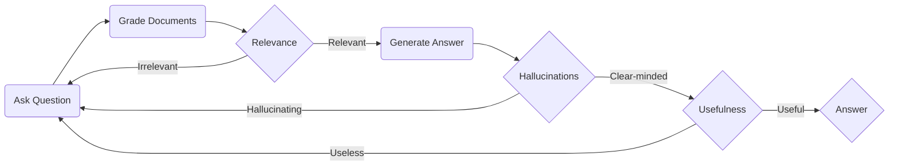

# LangGraph Rag Agent
## Overview

將 `pdfs` 中的資料儲存成 vector embeddings，在使用者輸入問題時便能根據問題的 embeddings 搜尋相關的上下文，再參考上下文中的內容生成問題的回覆。



## Installation

1. 安裝 [ollama](https://ollama.com/)
2. 執行 `ollama pull llama3`
3. 執行 `pip install -r requirements.txt`

## Example
假設要問`不定期檢查結果應於事件發生後多久內報主管機關備查?`。
```
$ python main.py
loading pdfs...
pdfs loaded.

User: 不定期檢查結果應於事件發生後多久內報主管機關備查？

Referenced documents: 
        At page 4 of "pdfs/水利建造物檢查及安全評估辦法110年10月5日版.pdf" wrote: 
                3  不定期檢查結果應於事件發生後十日內報主管機關備查。但有特殊情況經敘明理由報主
                管機關同意者，不在此限。
                4  應辦理安全評估之建造物其結構有重大災損或安全之虞時，應立即採取緊急措施，並向
        At page 11 of "pdfs/水利法-全國法規資料庫.pdf" wrote: 
                查，擬具收購、補償及遷移辦法，報經有關主管機關核准後實施。
                （刪除）
                水流因事變在低地阻塞時，高地所有權人得自備費用，為必要疏通之工
                事。
                減少閘壩啟閉之標準、水位或時間，由主管機關報請上級主管機關核定
                公告之。
        At page 0 of "pdfs/防水洩水建造物檢查複查及評鑑與水防道路橋梁檢測督導考核及評鑑作業要點1130123.pdf" wrote: 
                洪水、豪雨或其他災害事件後立即辦理檢查，並將其檢查結果於事件
                        發生後翌日起七日內函報水利署，但有特殊情況經敘明理由報本部同
                        意者，不在此限。
                    (三)日常巡檢：依河川分署訂定之安全維護手冊，辦理每月例行性巡檢。
        At page 2 of "pdfs/水利法-全國法規資料庫.pdf" wrote:
                主管機關因公共事業之需要，得變更或撤銷私人已登記之水權。但應由
                公共事業機構酌予補償。
                水權之取得、設定、移轉、變更或消滅，非依本法登記不生效力。 1
                前項規定，於航行天然通航水道者，不適用之。 2

Assistant: According to the context, 不定期檢查結果應於事件發生後十日內報主管機關備查.

User: exit

Bye.
```