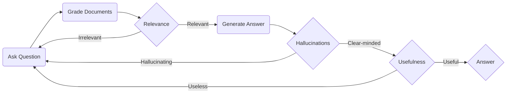
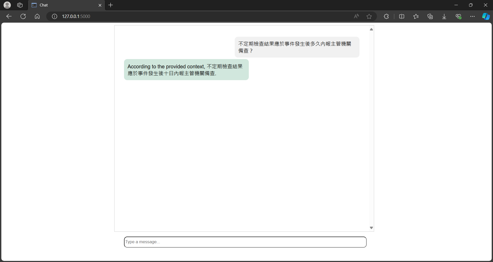

# LangGraph Rag Agent
## Overview

將 `pdfs` 中的資料儲存成 vector embeddings，在使用者輸入問題時便能根據問題的 embeddings 搜尋相關的上下文，再參考上下文中的內容生成問題的回覆。

## Installation

1. 安裝 [ollama](https://ollama.com/)
2. 執行 `ollama pull llama3`
3. 執行 `pip install -r requirements.txt`

## Example
假設要問`不定期檢查結果應於事件發生後多久內報主管機關備查?`。

1. 執行 `python app.py`
2. 在輸入框中輸入問題

3. 點擊回應查看相關資料
